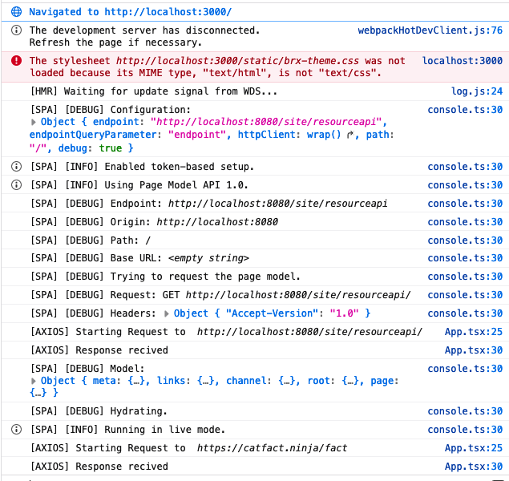

# BRxM React SDK Performance test

Example React SPA using the Bloomreach Experience [React SDK](https://www.npmjs.com/package/@bloomreach/react-sdk).

## Install and run
Run [Docker](https://hub.docker.com/r/bloomreach/xm-spa-example) container with the configured brXM instance:
```bash
docker run -p 8080:8080 bloomreach/xm-spa-example
```
Finally, build and run the React app as follows:

```bash
npm i --legacy-peer-deps
npm run start
```

The CMS should now be accessible at <http://localhost:8080/cms>, and it should render the React app in preview mode in the Experience manager. (`PW: admin/admin`)

The SPA itself can be accessed directly via <http://localhost:3000>.

## Performance Test

This test is to evaluate if a component that is not known by BRxM can make a call via Axios to any API endpoint, before the SPA Page Model is returned, or if it has to wait.
### Current

Using the debug that comes with the SPA SDK, and creating an axios interceptor on the other random request I added in, I can see that the BrPage component blocks any children from rendering, and thus making any out going request, until the response from the Page Model API is received:



### Workaround

With the same debug settings, I also tried a workaround and basically forced the app to render the children in paralell to the `BrPage` component (see branch [workaround](../../tree/workaround)). This worked, but I'm not at all convinvced this works at scale/with more complex pages. It also leads to a question of what is the best way to use the `BrPage` component with `Routes` - should it wrap the routes, or be re-rendered on each page change? 


### Conclusion

- Is it possible for the SPA SDK to be non-blocking? 
- Has this problem been faced before? 
- Is there any novel way to use the `BrPage` component to ensure that this doesn't happen? 